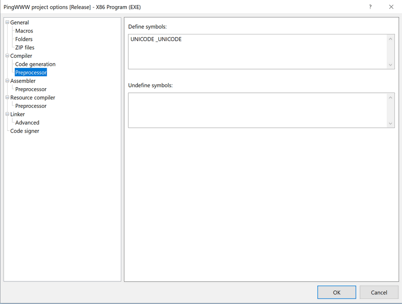
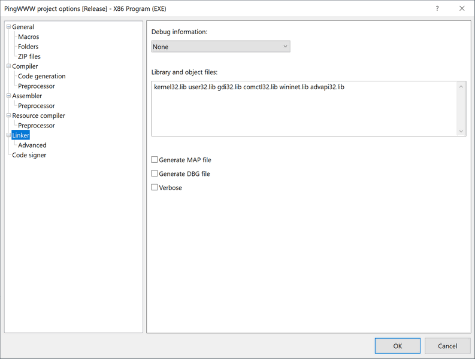

# Ping WWW


Мини-индикатор доступа в интернет в виде круглого полупрозрачного окошка поверх всех окон.

Реализован на C под Pelles C (Win32 GUI), без внешних зависимостей, с попиксельным антиалиасингом.

## Возможности

- **Цветовой индикатор**: зелёный (сеть есть), красный (нет сети)
- **Проверка** через `www.msftconnecttest.com/connecttest.txt` (HTTP 200 = успех)
- **Интервалы**: 5 с при успехе, 1 с при сбое
- **Поп-ап при перетаскивании**: зажатие ЛКМ показывает рядом с индикатором скруглённый поп-ап: URL репозитория, ап-тайм и подсказки по управлению (2×ЛКМ — прозрачность, ПКМ — размер, Esc с зажатой ЛКМ — выход); поп-ап следует за перетаскиванием, клики по нему проходят насквозь, при отпускании ЛКМ скрывается
- **Перетаскивание** мышью
- **Три размера**: 30 / 50 / 70 пикселей (циклическое переключение ПКМ, центр остаётся на месте, позиция клампится в рабочую область монитора)
- **Прозрачность 50%**: двойной клик ЛКМ переключает между 50% и 100%
- **AlwaysOnTop**, без рамок, полупрозрачное окно
- **Попиксельный антиалиасинг** края круга через `UpdateLayeredWindow` + premultiplied ARGB
- **HTTP-проверка в отдельном потоке** — UI не подвисает во время запроса
- **Esc** — закрыть: удерживать ЛКМ на индикаторе (состояние перетаскивания) и нажать `Esc`; отпускание ЛКМ сбрасывает состояние
- **Сохранение состояния:** позиция окна, выбранный размер и уровень прозрачности запоминаются в реестре (`HKCU\Software\PingWWW`) и восстанавливаются при следующем запуске; если монитор отключили — позиция автоматически прижимается к рабочей области
- **Защита от дубликатов (Single Instance):** при попытке повторного запуска выводится предупреждение, а новая копия блокируется, пока не будет закрыта уже работающая

## Требования

- Windows 7 / 10 / 11

Для запуска:
- Готовый `PingWWW.exe` запускается без установки зависимостей

Для пересборки:
- [Pelles C 14.50](https://www.pellesc.de/) (также MinGW / MSVC)

## Установка

### Вариант 1 — готовый exe

1. Скачайте `PingWWW.exe` из раздела Releases (или из корня репозитория)
2. Запустите его двойным кликом

> При первом запуске Windows SmartScreen может показать предупреждение о неизвестном издателе — файл несигнирован. Выберите «Дополнительные параметры» → «Выполнить в любом случае».

### Вариант 2 — сборка из исходников

1. Установите [Pelles C 14.50](https://www.pellesc.de/)
2. Откройте `PingWWW.ppj` (**File → Open → Project**)
3. При необходимости проверьте настройки:

   **Project → Options → Compiler → Preprocessor** → Define symbols: `UNICODE _UNICODE`



4. **Project → Options → Linker** → Library and object files: `kernel32.lib user32.lib gdi32.lib comctl32.lib wininet.lib`





5. **Build → Build**. На выходе — `PingWWW.exe` без внешних зависимостей

Файл `PingWWW.c` сохранять в **UTF-8 with BOM**.

Окно появляется в левом верхнем углу (50, 50), размер 50 пикселей, прозрачность 50%.

## Управление

| Действие | Управление |
|----------|------------|
| Смена размера | ПКМ по кружку |
| Перетаскивание | ЛКМ + drag (при зажатии рядом показывается поп-ап: URL, ап-тайм и подсказки) |
| Прозрачность 50% / 100% | Двойной клик ЛКМ по кружку |
| Закрыть | Удерживать ЛКМ на индикаторе + `Esc` |

## Как это работает

Состояние программы (координаты `PosX` / `PosY`, индекс размера `SizeLevel` и флаг `Transparent`) сохраняется в реестре Windows (`HKEY_CURRENT_USER\Software\PingWWW`) через `RegSetValueExW` при закрытии и читается через `RegQueryValueExW` при старте. Это позволяет обойтись без создания отдельных ini-файлов. Код обратно совместим: если в реестре нет новых ключей (например, после обновления со старой версии), программа просто использует значения по умолчанию.

Программа периодически выполняет HTTP GET-запрос к `www.msftconnecttest.com/connecttest.txt`:

- Получен статус **200** → окно зелёное, следующая проверка через **5 с**
- Ошибка или нет 200 → окно красное, следующая проверка через **1 с**

HTTP-запрос выполняется в отдельном потоке (`CreateThread`), результат возвращается в UI-поток через `PostMessage(WM_APP_CHECK_DONE, ...)`. Таймауты WinINet (connect / send / receive) — по 1 с.

Отрисовка окна — через `UpdateLayeredWindow` с DIB-секцией 32 бит (premultiplied ARGB). Край круга сглаживается линейной формулой покрытия пикселя. Поп-ап при перетаскивании отрисовывается той же техникой: GDI рисует текст на непрозрачной DIB, затем постобработка задаёт скругление углов и premultiplied альфу.

## Структура репозитория

```text
ping-www/
├── .gitignore
├── LICENSE
├── README.md
├── PingWWW.c
├── PingWWW.ppj
├── PingWWW.exe
├── compiler-defines.png
└── linker-libraries.png
```

## Лицензия

MIT
